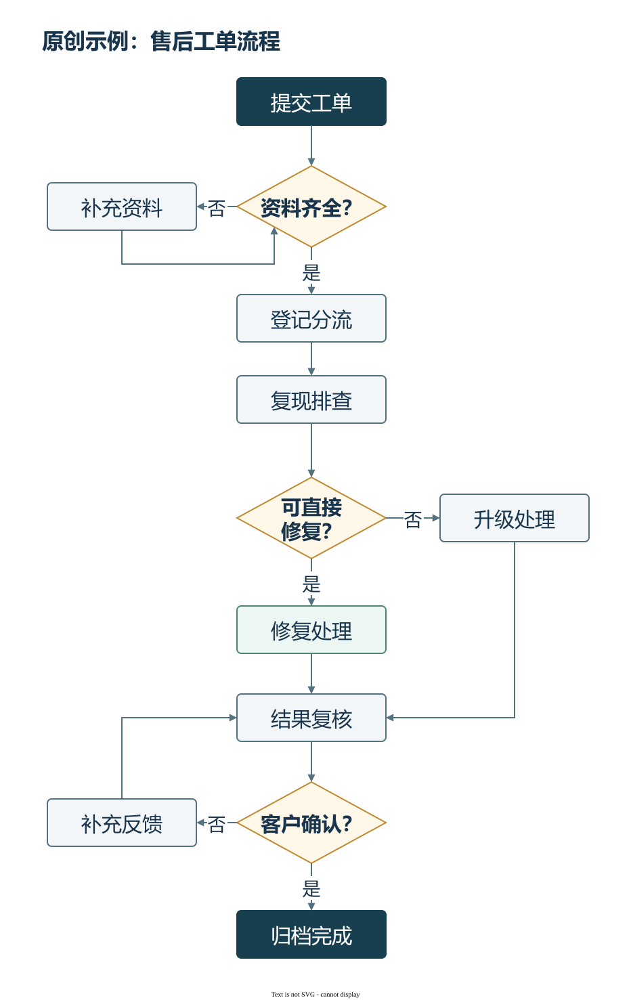

# 截图里的流程图，重画后能改字、改连线

把已有流程图截图或手绘草图整理成可继续编辑的文件，用于文档、汇报和流程说明

这张图是原创虚构的售后工单流程，用来展示文字、判断分支和连接线的排布，不是真实客户项目

## 查看与编辑示例

- [draw.io 原生源文件](./example.drawio)：在 diagrams.net 或 draw.io 中打开，可修改文字、节点和连接线
- [SVG 矢量示例](./example.svg)：浏览器可查看，放大不影响矢量线条

当前展示文件为 draw.io / SVG，PPTX不作为这份示例的展示格式

## 流程图重画服务

- 5元/张：原图清楚、已有连接关系明确、20个文字标签以内
- 多张可优惠；复杂图或新增内容先看原图确认总价
- 正式订单可选PPTX或SVG源文件之一，另附PNG预览图
- 含1次同范围修改；漏字、错线免费修正，不占修改次数
- 制作含AI辅助，交付前核对文字、连线和文件

## 发图询价

在[闲鱼商品页](https://www.goofish.com/item?id=1090670884593)发脱敏原图、所需文件格式和使用时间，看图确认总价与交期，再按平台流程下单

## English

Flowcharts from screenshots or sketches are redrawn into editable files with changeable text and connectors. This original fictional example is available in draw.io and SVG. Custom orders offer PPTX or SVG plus PNG, with one round of in-scope revisions. Send a redacted image, required format and deadline through the linked Xianyu listing to confirm scope and price. Production uses AI assistance with delivery checks.
